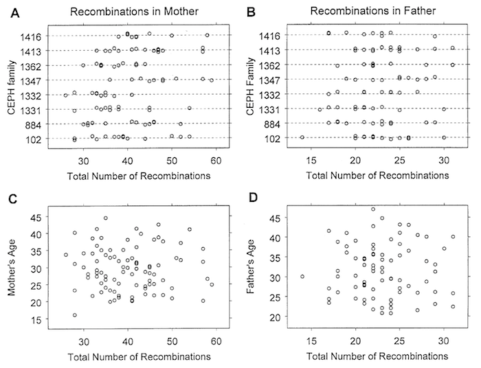

building


<div class="navbar">
  <div class="navbar-inner">
      <ul class="nav">
          <li><a href="mousebc_fig3.html">prev</a></li>
          <li><a href="iplotCorr.html">next</a></li>
      </ul>
  </div>
</div>

A general way to solve a Sudoku puzzle is to use DFS. Here is a sample code:

```C++
// determine the board is valid or not.
bool isValid(vector<vector<char>>& board, int row , int column, char c){
        for (int i = 0; i < 9; ++i)
            if (board[row][i] == c) return false;
        for (int j = 0; j < 9; ++j)
            if (board[j][column] == c) return false;
        for (int i = 0; i < 3; ++i)
            for (int j = 0; j < 3; ++j)
                if (board[row / 3 * 3 + i][column / 3 * 3 + j] == c)
                    return false;
        return true;
    }
    bool solve(vector<vector<char>>& board) 
    {
        for (int i = 0; i < 9; ++i)
        {
            for (int j = 0; j < 9; ++j)
            {
                if ('.' == board[i][j]) 
                {
                    for (int k = 0; k < 9; ++k)
                    {
                        if (isValid(board, i, j, '1' + k)) 
                        {
                            board[i][j] = '1' + k;
                            if (solve(board)) return true;
                            else board[i][j] = '.';
                        }
                    }
                    return false;
                }
            }
        }
        return true;
    }
    void solveSudoku(vector<vector<char>>& board) 
    {
        solve(board);
    }
};
```
'''c++

'''

Broman KW, Murray JC, Sheffield VC, White RL, Weber JL (1998) Comprehensive human genetic maps: Individual
and sex-specific variation in recombination. Am J Hum Genet 63:861-869
[](http://www.ncbi.nlm.nih.gov/pubmed/9718341)
[](http://www.biostat.wisc.edu/~kbroman/publications/geneticmaps.pdf)



**Figure 3**. &mdash; Total no. of observed recombination events in the 22
autosomes in each male and female meiosis, plotted by family (A and
B) and against the age of the parent at the birth of the
corresponding child (C and D).